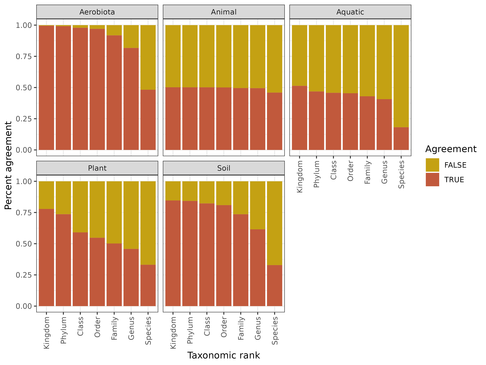
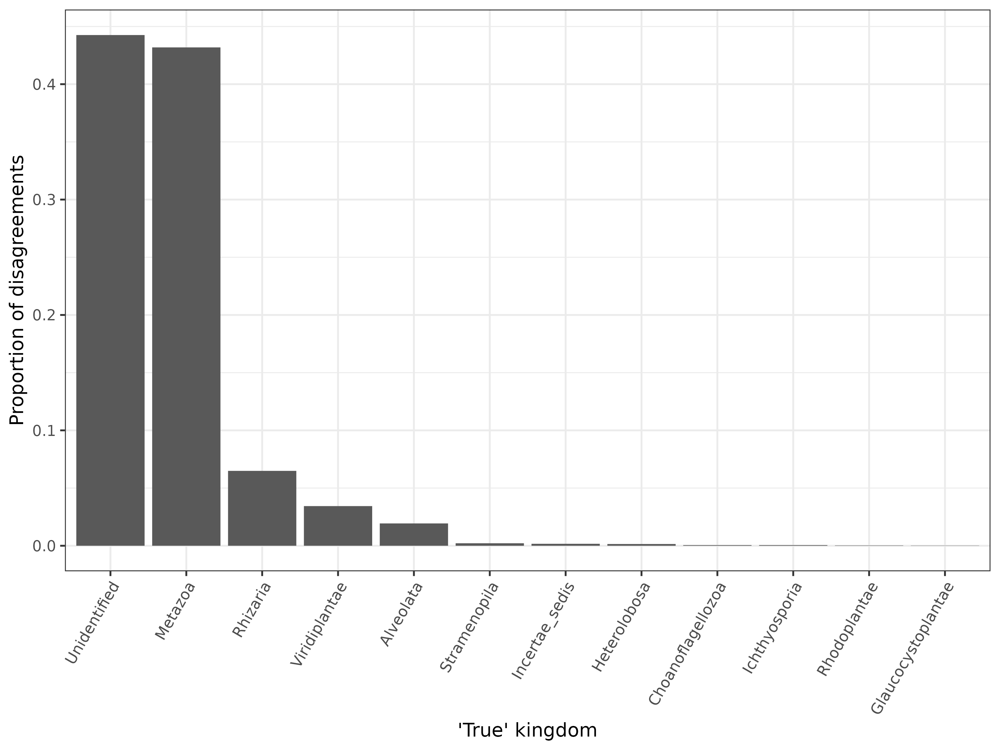

```{r setup, include=FALSE}
knitr::opts_chunk$set(echo = FALSE,warning = FALSE,message = FALSE)
library(tidyverse)
library(easystats)
library(kableExtra)
library(knitr)
```


```{r}
metadata <- readRDS("./output/manuscript_figs/metadata_table_kable.RDS")
# mod <- readRDS("./output/manuscript_figs/kingdom_aov_mod.RDS")
```

### Background

**Text from Clayton**

___


### Methods

**Text from Clayton** 

**Add computational methods from workflow.txt**

Selected fungal meta-amplicon studies and broad metadata

```{r}
readRDS("./output/manuscript_figs/metadata_table_kable.RDS") %>% 
  kable_classic(lightable_options = "hover")
```


___

### Initial results

**Add boring stats:**

  - Seqs stats (tracking read counts through pipeline for all studies in total)
  - How many ASVs we found in total
  - Overall breakdown of UNITE taxonomy (stacked bar charts?)
  - Overall breakdown of UNITE+Euk taxonomy (stacked bar charts?)


```{r}

```


```{r}

```

**We may also want to use BLAST top-hit**

**Include big supplemental table of ASV | UNITE | UNITE+Euk | BLAST**
___


### Conclusions

  1. Outgroups change taxonomic assignments sometimes
  2. Using UNITE (just fungi) means that almost everything is assigned as a fungus, even if it really isn't
  3. Most non-fungi that are assigned incorrectly as a fungus, are actually either metazoans or unidentified
  4. Some habitats seem to suffer from this more than others... Aero and soil studies have the least problem
  5. The former observation is possibly due to UNITE having more soil fungi in it than plant- and animal-associated fungi

___

<br><br><br>